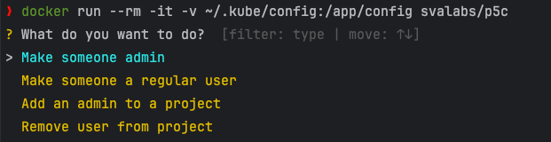

# p5c - The Kubermatic Kubernetes Platform (KKP) skeleton key

p5c (**p**rives**c**), is a CLI tool to quickly manage permissions within a KKP installation.


## Dependencies

This project uses the following Python packages:

- [kubernetes](https://pypi.org/project/kubernetes/)
- [survey](https://pypi.org/project/survey/)

Please use a recent Python version

## Features

 The script allows you to:
- Promote a non-admin user to an admin
- Demote an admin user to a regular user
- Add an admin to a project
- Remove a user from a project

## Installation
 
There are multiple ways of installing p5c:

### Docker 

```bash
git clone https://github.com/svalabs/p5c.git
cd p5c/
docker buildx build -t svalabs/p5c .
```

### Podman (MacOS M1+)

```bash
git clone https://github.com/svalabs/p5c.git
cd p5c/
podman buildx build --platform=linux/arm64 --network slirp4netns -t svalabs/p5c .
```

### Native

```bash
git clone https://github.com/svalabs/p5c.git
cd p5c/
python -m venv venv
source venv/bin/activate
pip install -r requirements.txt
```

## Usage

Just run the script, and it will guide you through the steps:




### Docker

The containerized version expects the KUBECONFIG to be mounted to `/app/config`.

```bash
docker run --rm -it -v ~/.kube/config:/app/config svalabs/p5c
```

### Podman (MacOS M1+)

The containerized version expects the KUBECONFIG to be mounted to `/app/config`.

```bash
podman run --rm -it -v ~/.kube/config:/app/config svalabs/p5c
```

### Native

Please ensure that the environment variable `$KUBECONFIG` is set!

```bash
source venv/bin/activate
python main.py
```
